# drawio-themer

Apply modern, semantic visual themes to existing draw.io / diagrams.net
`.drawio` files — from the command line, without touching geometry,
topology, or shape semantics.

[](https://github.com/tbrandenburg/drawio-themer/actions/workflows/checks.yml)
[](package.json)
[](LICENSE)

<table>
<tr>
<th align="center">Before</th>
<th align="center">After — <code>dark-neon-mode</code> theme</th>
</tr>
<tr>
<td>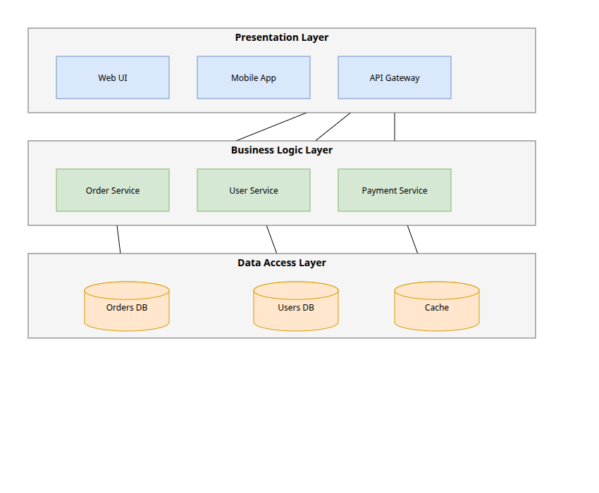</td>
<td>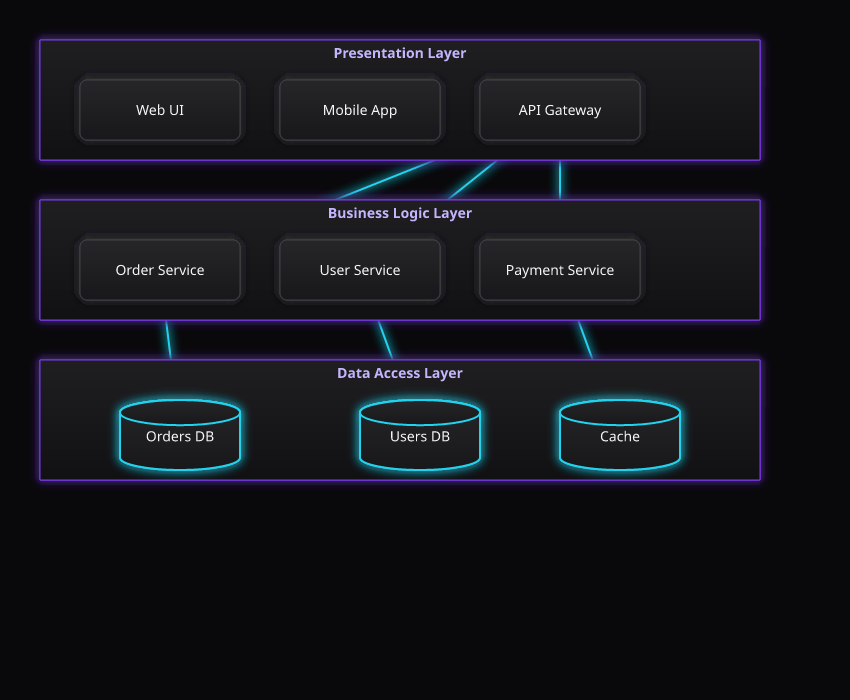</td>
</tr>
</table>

## Table of contents

- [Why](#why)
- [Features](#features)
- [Install](#install)
- [Usage](#usage)
- [Themes](#themes)
- [Development](#development)
- [License](#license)

## Why

Manually restyling every shape in a `.drawio` file — fills, strokes,
fonts, corner radius, edge arrows — is tedious and error-prone, and
generic "convert to X" tools tend to mangle geometry, connections, or
shape semantics (a database cylinder becoming a plain rectangle, for
example). `drawio-themer` rewrites only presentational style
properties via a small YAML theme, leaving everything else — layout,
connections, embedded images/icons, shape types — untouched.

## Features

- **Safe by construction** — a style-property allow-list (see
  [`docs/PRD.md`](docs/PRD.md#10-style-allow-list)) guarantees geometry,
  topology, and shape type are never rewritten.
- **Semantic classification** — nodes, edges, containers, and database
  shapes are classified automatically and themed with distinct rules.
- **Multi-page & compressed diagrams** — supports both inline and
  `raw-deflate` + base64 compressed page content.
- **Idempotent** — re-applying a theme to an already-themed file is a
  no-op.
- **Bundled themes** — ships with 10 built-in themes covering light
  and dark, muted and vibrant, professional and accessibility-first
  styles (`shadcn-modern`, `dark-neon-mode`, `nord`, `dracula`,
  `solarized-light`, `gruvbox`, `catppuccin-mocha`, `monokai`,
  `github-light`, `high-contrast`); write your own in a few lines of
  YAML.

## Install

Run the published CLI without installing it:

```sh
npx --yes drawio-themer@latest --help
```

For a persistent global installation:

```sh
npm install --global drawio-themer
```

After global installation, the `drawio-themer` command is available directly.

For local development from a checkout:

```sh
npm install
npm run build
```

To use the locally built command directly, install this checkout globally:

```sh
make install-global
```

## Usage

```sh
drawio-themer apply input.drawio -t shadcn-modern -o output.drawio
```

Or run the published CLI with `npx`, without a global install:

```sh
npx --yes drawio-themer@latest apply input.drawio -t shadcn-modern -o output.drawio
```

Or without an npm install, run the built CLI directly from a checkout:

```sh
node dist/cli.js apply input.drawio -t shadcn-modern -o output.drawio
```

Or during development, without a build step:

```sh
npx tsx src/cli.ts apply input.drawio -t shadcn-modern -o output.drawio
```

### Options

```
drawio-themer apply <input>
Options:
  -t, --theme <theme>       Built-in theme name or theme file
  -o, --output <file>       Output .drawio file
      --dry-run             Analyze without writing
      --format <format>     preserve | compressed | uncompressed
      --verbose             Show matching/transformation details
      --no-theme-metadata   Do not annotate generated file
      --png-original <file> Render the input (pre-theme) file as an
                            approximate PNG render
      --png-themed, --png <file>
                            Render the themed output as an approximate
                            PNG render
      --svg-original <file> Render the input (pre-theme) file as an
                            approximate SVG render
      --svg-themed, --svg <file>
                            Render the themed output as an approximate
                            SVG render
  -h, --help
```

PNG/SVG renders are an offline, approximate rasterization of the diagram
(rects, database cylinders, edges clipped to node borders, labels) meant
for a quick visual check — not a substitute for opening the file in real
draw.io (no waypoints, groups, rotation, or HTML labels support):

```sh
node dist/cli.js apply input.drawio -t dark-neon-mode -o output.drawio \
  --png-original before.png \
  --png-themed after.png \
  --svg-original before.svg \
  --svg-themed after.svg
```

## Themes

A theme is a YAML file of design tokens plus a small set of rules
matched against classified cells (`node`, `edge`, `container`,
`database`) or explicit tags. Ten themes are bundled:

- [`shadcn-modern`](src/themes/shadcn-modern.yaml) — light,
  shadcn/ui-inspired default
- [`dark-neon-mode`](src/themes/dark-neon-mode.yaml) — dark zinc base
  with a violet/cyan glow accent (shown in the demo above)
- [`nord`](src/themes/nord.yaml) — cool arctic blues, muted,
  professional-dark
- [`dracula`](src/themes/dracula.yaml) — vibrant purple/pink/green
  dark
- [`solarized-light`](src/themes/solarized-light.yaml) — warm cream,
  low-contrast, eye-friendly
- [`gruvbox`](src/themes/gruvbox.yaml) — warm retro browns/oranges,
  dark
- [`catppuccin-mocha`](src/themes/catppuccin-mocha.yaml) — soft
  pastel dark
- [`monokai`](src/themes/monokai.yaml) — classic yellow/green/pink
  code-editor dark
- [`github-light`](src/themes/github-light.yaml) — clean
  corporate/professional light
- [`high-contrast`](src/themes/high-contrast.yaml) — WCAG-AA-oriented
  black/white/yellow, accessibility-first

Each render below shows the same fixture
(`docs/assets/fixtures/layered-architecture.drawio`) via
`apply --png-themed` (see [Usage](#usage) above). Only the
vibrant/neon-leaning dark themes (`dark-neon-mode`, `dracula`,
`monokai`) opt into the render's glow filter (`glow: true` in
their YAML) — muted, light, retro, or accessibility-focused themes
render flat/crisp on purpose.

| Theme              | Render                                                       |
| ------------------ | ------------------------------------------------------------ |
| `shadcn-modern`    | 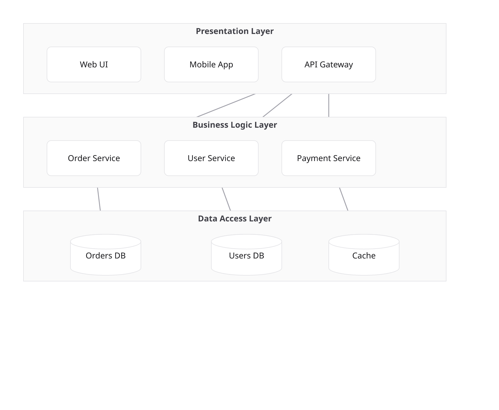       |
| `dark-neon-mode`   |      |
| `nord`             | 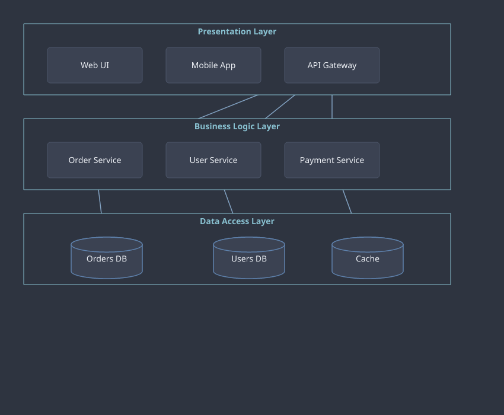                         |
| `dracula`          | 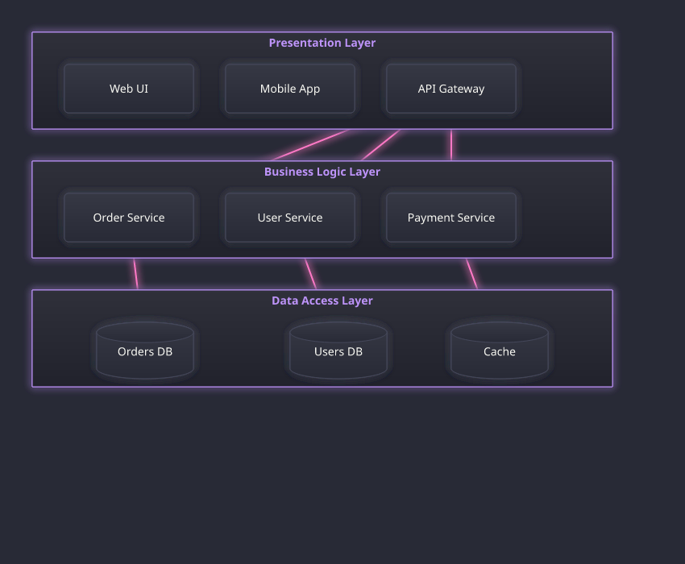                   |
| `solarized-light`  | 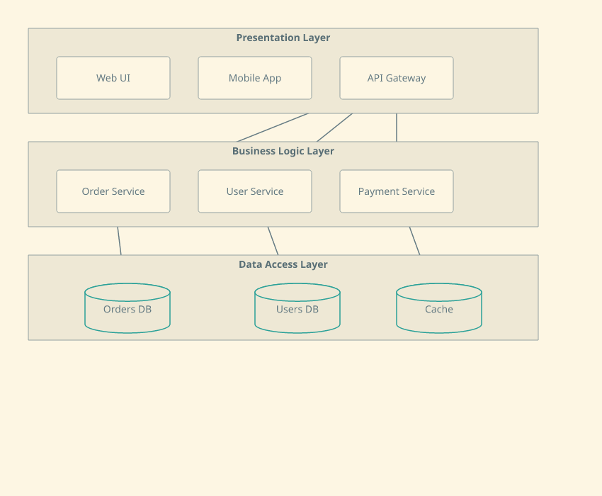   |
| `gruvbox`          | 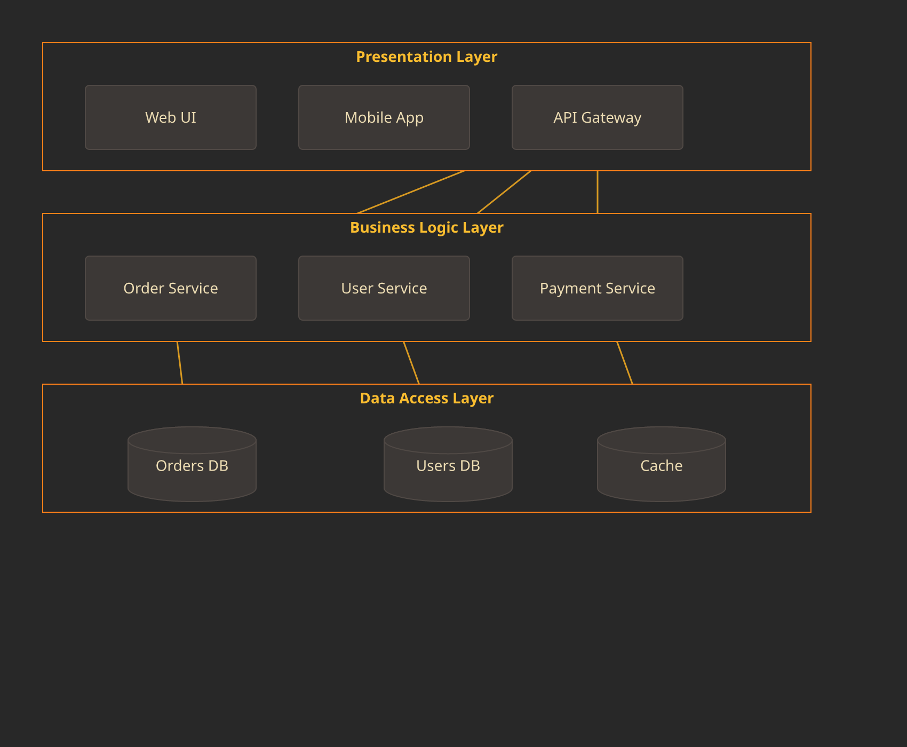                   |
| `catppuccin-mocha` | 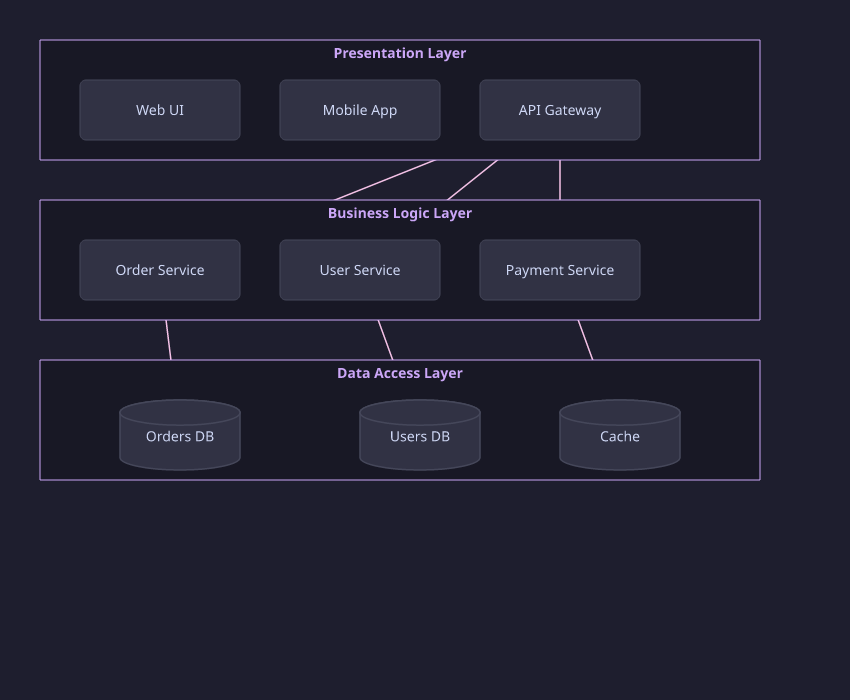 |
| `monokai`          | 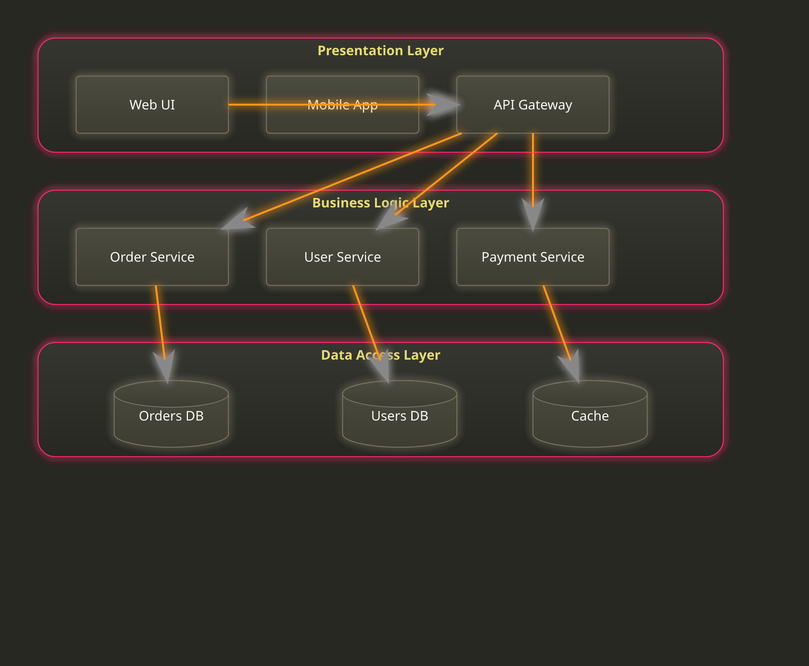                   |
| `github-light`     | 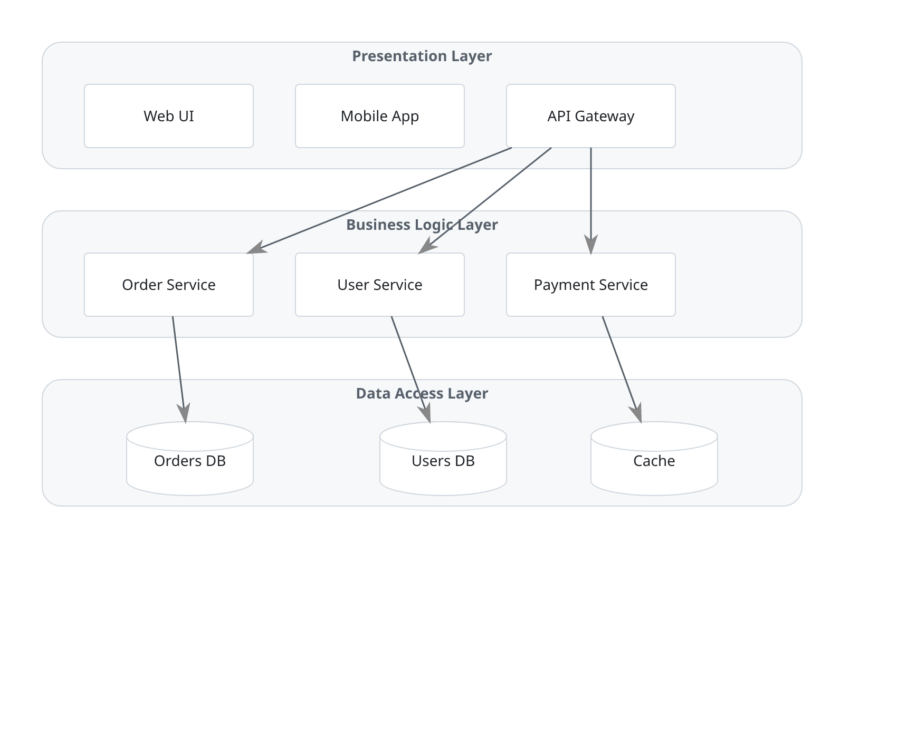         |
| `high-contrast`    | 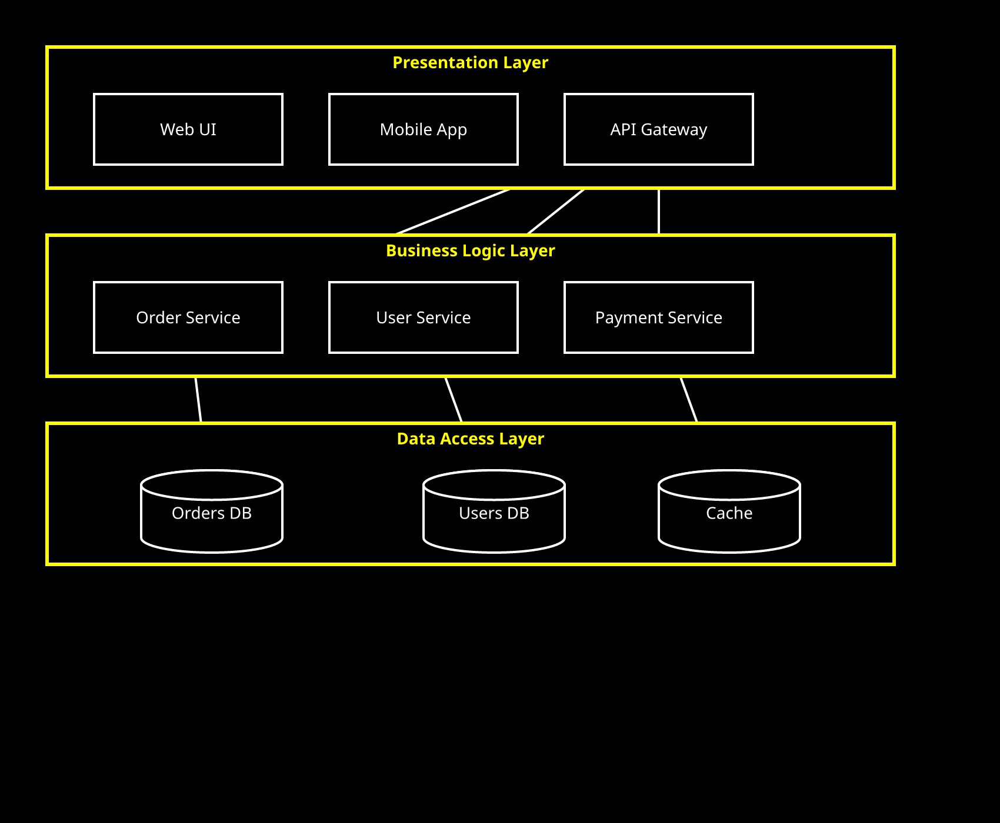       |

See [`docs/PRD.md`](docs/PRD.md) for the full theme format and style
allow-list.

## Development

Common tasks are wrapped in a `Makefile` with a dependency chain
(`format-check` -> `lint` -> `build`/`test` -> `run` -> `release-*`), so
each target re-verifies the gates before it:

```sh
make format          # prettier --write (mutates files)
make format-check    # prettier --check (CI-safe, no mutation)
make lint            # format-check + eslint
make test            # lint + build + vitest
make run             # test + `node dist/cli.js --version`
make install-global  # build + `npm install -g .` (adds `drawio-themer` to PATH)
make release-patch   # run + npm version patch + git push --follow-tags
make release-minor   # run + npm version minor + git push --follow-tags
make release-major   # run + npm version major + git push --follow-tags
```

Plain npm scripts are also available (`npm run build|lint|test|format|format:check`).

CI runs `make format-check`, `make lint`, and `make test` as separate
required checks (`Checks / Format`, `Checks / Lint`, `Checks / Tests`)
on every pull request.

## License

[MIT](LICENSE)
